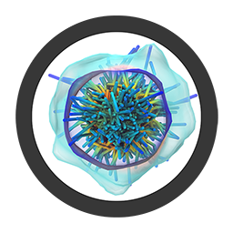

# Gromacs GUI

    

**Gromacs GUI** is a graphical user interface application for Gromacs

[Latest Version 1.20.11](https://github.com/jsmaatta/GromacsGUI)

Features
--------
- Currently only shows one simulation
- **MacOS** application
- Supports GPU instancing
- Reads [chemfiles](https://github.com/chemfiles/chemfiles) formats
- Built with [Depict Engine](https://github.com/jsmaatta/Depict)

Dependencies
------------
- [Gromacs](http://www.gromacs.org/)
- Simple DirectMedia Layer 2

Copyright (c) **Jukka Maatta** 2020
